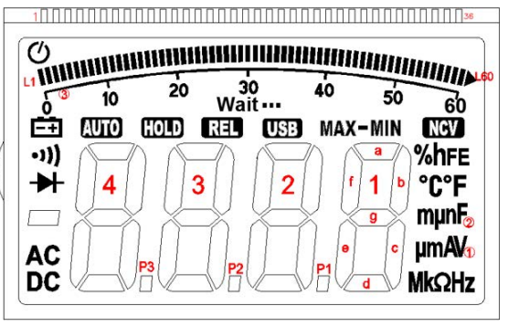
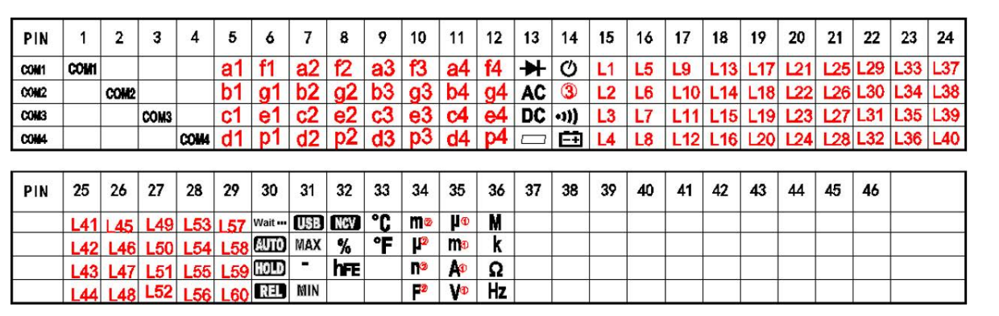

# Introduction
This project aims at measuring the current and temperature of an FPGA chip and plot them in real-time.
The current is measure by **DURATOOL D03122** and the temperature is read by a Tcl script from Vivado.

## DMM Logger
The data is transfered from the multimeter over UART with:
* baud rate: 9600
* no calibration
* 8 digit data
* one stop bit

The sequence of data transmission has been shown in the figure below.

